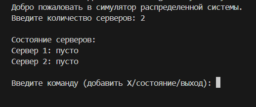
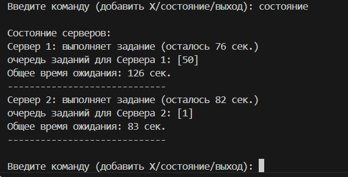
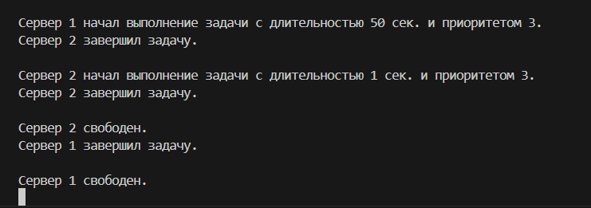

# **Distributed system**

Этот проект представляет собой симулятор распределённой системы для обработки задач. Система состоит из нескольких серверов, которые принимают задачи с разной приоритетностью и обрабатывают их в порядке очереди. Проект демонстрирует распределение задач между серверами с учётом их загруженности и приоритетов.

Функционал:
 - Задачи направляются на серверы с минимальным временем ожидания, чтобы быстрее войти в работу.
 - Каждая задача имеет приоритет: 1 — высокий, 2 — средний, 3 — низкий. Серверы обрабатывают задачи, начиная с наиболее приоритетных.
 - Возможность получить текущее состояние всех серверов.

Stack: Python, thread, itertools, queue

### Локальный запуск проекта:

**_Склонировать репозиторий к себе_**
```
https://github.com/TatianaSharova/DistributedSystem.git
```
**_Запустить систему из директории проекта:_**

Для Linux/macOS:
```
python3 system.py
```
Для Windows:
```
python system.py
```

### Примеры работ программы:
1. Инициализация


2. Добавление заданий:


3. Просмотр состояния серверов:


4. Обработка заданий:


5. Выход из программы:


Или нажать Ctr+C

### Автор
[Татьяна Шарова](https://github.com/TatianaSharova)